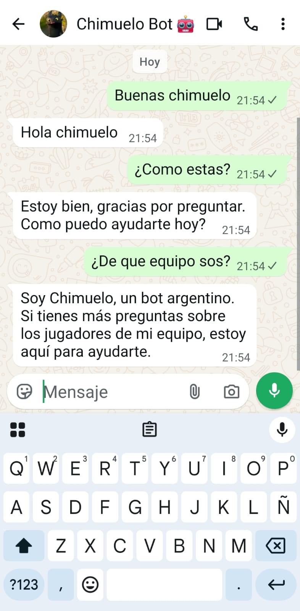
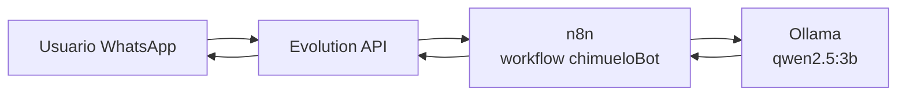

# ChimueloBot

Bot conversacional de **WhatsApp** con personalidad argentina. Cuando alguien lo menciona en un chat privado, responde con un LLM local, sin depender de servicios en la nube.

Creado por **Ramiro De Rogatis**.



*Chimuelo respondiendo en WhatsApp: se presenta como "Soy Chimuelo" y contesta preguntas sobre las fichas de su base de conocimiento.*

## Cómo funciona

El bot es un workflow de **n8n** expuesto por webhook. El flujo:

1. **Webhook** (`POST /webhook/chimuelo`) recibe los eventos de Evolution API (puente de WhatsApp).
2. **Filtro de evento**: solo continúa si es `messages.upsert` (mensajes nuevos).
3. **Filtro de salida**: ignora mensajes enviados por el propio bot (`fromMe == false`).
4. **Filtro de chat**: responde solo en chats privados (descarta grupos `@g.us`).
5. **Gatillo**: el mensaje contiene `"chimu"` o menciona/reply al usuario del bot.
6. **Ollama**: llama al LLM local `qwen2.5:3b` (temperature 0.2, `num_predict` 80) con el prompt de personalidad + fichas + el mensaje del usuario.
7. **Respuesta**: devuelve el texto al chat original vía Evolution API.

## Stack

| Servicio   | Imagen                          | Puerto  | Rol                              |
|------------|---------------------------------|---------|----------------------------------|
| n8n        | `n8nio/n8n:latest`              | `5678`  | Orquestador / editor de workflows |
| postgres   | `postgres:16`                   | `5432`  | Base de datos de Evolution API   |
| redis      | `redis:7-alpine`                | `6379`  | Cache de Evolution API           |
| evolution  | `evoapicloud/evolution-api`     | `8080`  | Puente de WhatsApp               |
| ollama     | *(externo, en el host)*         | `11434` | LLM local `qwen2.5:3b`           |

## Arquitectura



## Puesta en marcha

Requisito: [Ollama](https://ollama.com) corriendo en el host con el modelo descargado:

```bash
ollama pull qwen2.5:3b
```

Levantar los servicios:

```bash
docker compose up -d      # levanta n8n, postgres, redis y evolution
docker compose down       # detiene todo
docker compose logs -f n8n  # ver logs de n8n
```

- **UI de n8n**: http://localhost:5678
- **Webhook entrante**: `POST http://<host>:5678/webhook/chimuelo`
- **Timezone**: `America/Argentina/Buenos_Aires`

## Personalidad y fichas

El prompt del workflow define la personalidad de Chimuelo:

- Español argentino, corto y amistoso. Si le preguntan qué es, responde **"Soy Chimuelo"**.
- Nunca menciona que es una IA ni el modelo que lo usa.
- Base de conocimiento **"FICHAS"** embebida en el prompt: ~22 personas del club (jugadores, DT, familia, etc.).
- Reglas estrictas: responde solo la ficha consultada, no inventa datos, y si la persona no está en la lista dice que no tiene esa información.
- Solo combina fichas si le piden una comparación explícita.

## Estructura del repo

```
chimueloBot/
├── CapturaChimuelo.jpeg        # captura de ejemplo
├── README.md
├── docker-compose.yml          # infraestructura (4 servicios)
├── backups/
├── logs/
└── data/
    ├── n8n/                    # volume de n8n (workflows en SQLite)
    │   └── database.sqlite
    └── postgres/               # data de PostgreSQL
```

## Troubleshooting

```bash
docker compose ps                        # estado de los contenedores
docker compose logs -f evolution         # logs del puente de WhatsApp
docker compose restart n8n               # reiniciar n8n
docker compose up -d --force-recreate    # recrear todo
```

Si el bot no responde, verificá que Ollama esté activo y que Evolution API tenga la instancia de WhatsApp conectada.

## Nota de seguridad

`docker-compose.yml` contiene credenciales en texto plano (contraseña de Postgres y API key de Evolution API). No lo compartas públicamente sin antes externalizar los secretos (por ejemplo con un archivo `.env` y `.gitignore`).
